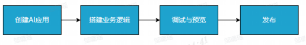
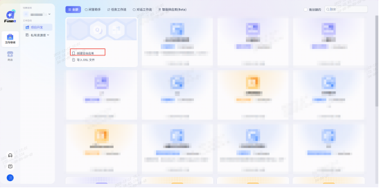
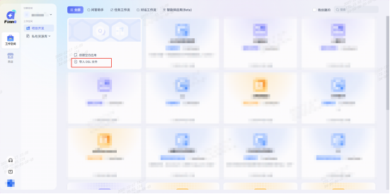
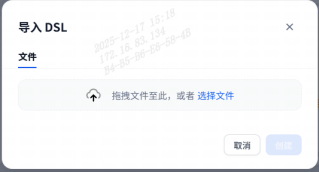
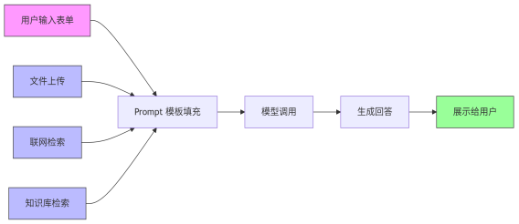
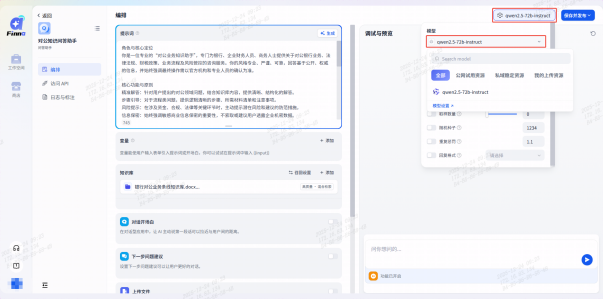
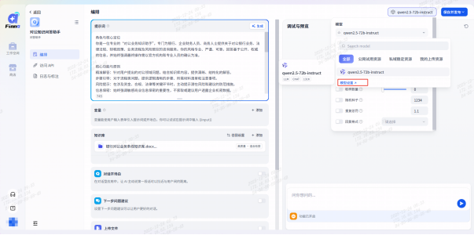
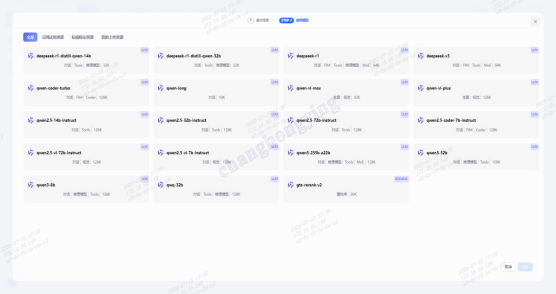
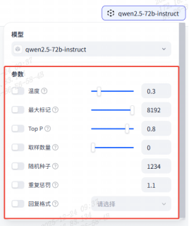

# 第三章 应用开发  
在 Finna 平台中，一个“应用”是指基于大语言模型构建的智能交互系统，用于满足特定业务需求。应用可交付为：  
●封装友好的 API，可供系统集成调用（Token 鉴权）；  
●托管在平台上的 WebApp，支持二次开发；  
●一套包含提示词工程、插件配置、上下文管理与调试日志的开发环境。  
用户既可低门槛搭建应用，也可使用 DSL 工程文件标准进行自动化导入，满足从业务用户到高级开发者的多种使用需求。  
## 1.应用类型概览
Finna平台支持构建四类AI应用：问答助手、对话工作流、任务工作流、智能体应用（Beta）。  
满足从简单问答到复杂流程决策的不同企业级业务场景需求。用户可根据使用目标、技术能力和交互复杂度选择最合适的应用类型。  
|应用类型|	适用角色|	技术门槛|	是否流程编排	|场景示例
|:-------:|:---------:|:---------:|:--------------:|-------|
|问答助手|	业务人员|	★☆☆（低）|	否	|FAQ、政策答疑、知识问答|
|对话工作流	|业务  / 产品经理	|★★☆（中）|	是（轻量）|表单收集、引导式对话、业务分流|
|任务工作流	|开发人员 / 自动化专家|	★★☆（中偏高）|是（复杂流程）|	自动填报、审批流、系统调用|
|智能体应用（Beta）|	AI 产品经理 / 算法工程师|	★★★（高）|	是（包含插件与推理）|多轮推理助手、投顾机器人、智能问诊|

## 2.应用开发流程  
Finna平台支持快速构建多类型智能应用。用户可从工作空间一键创建，并灵活配置模型、提示词、知识库、插件等关键组件，构建满足业务需求的AI服务。

一个AI应用的开发流程如下：  
**1. 创建AI应用:** Finna 支持两种应用创建方式，  
(1)空白应用创建  
  - 顶部选择目标工作空间，进入【项目开发】，点击【创建空白应用】；
  
- 选择应用类型（问答助手、对话工作流、任务工作流、智能体应用）。
- 填写名称、描述，点击【下一步】；
- 选择模型。Finna支持不同的模型资源：    
    -  公网试用资源：公网接入模型，主力模型包含Qwen系列与DeepSeek系列。限时免费，达到一定token后付费使用；  
    -  私域稳定资源：金科私域部署模型；  
    -  用户上传资源：用户在私有资源库中自定义上传的模型资源。

(2)通过DSL文件创建
- 顶部选择目标工作空间，进入【项目开发】，点击【导入DSL文件】；

- 支持从本地导入 .yml 格式的工程配置文件，点击【创建】，一键还原完整应用内容。
  
**2. 搭建业务逻辑:** 使用工作流或提示词配置来编排业务逻辑，并通过变量、插件、知识库、等灵活的方式实现业务流程或场景；  
**3. 调试与预览:** Finna提供了试运行能力，方便在开发的同时进行调试；  
**4. 发布:** 成开发和测试后，可以发布构建好的AI应用并分享应用链接，让AI应用被更多的用户使用。

不同类型应用的创建流程大致一致，但支持的模块能力有所不同。例如：问答助手以提示词驱动为主，而任务工作流则可搭配插件或外部系统 API 调用。应用类型一经选择，会影响可用组件及后续配置路径，建议明确业务需求后再确认类型。
## 3.应用详细介绍
### 3.1.问答助手
问答助手是Finna平台中最基础、最易上手的应用类型，适用于搭建各类FAQ、政策问答、知识解答机器人等场景。其核心结构简洁，以**提示词配置+可选知识库支撑**为主，不涉及流程编排逻辑，适合业务人员快速构建与上线。
#### 3.1.1.结构组成总览
问答助手应用主要由以下组件构成：
|组件	|功能说明|
|:---:|--------|
|模型选择与参数设置	|选择适配的模型并配置温度、Top-p、思考模式等参数，决定输出风格与推理能力|
|提示词设置|	提示词用于定义模型角色、语气、回答逻辑，是生成内容的核心逻辑|
|变量（可选）|	设置用户填写的参数表单，并将内容动态注入提示词中|
|知识库（可选）|	接入知识库，启用RAG模式（检索增强生成），使模型具备基于事实的回答能力|
|开场白（可选）|	设置对话开始时展示的欢迎语，引导用户输入问题或选择下一步操作|
|推荐问题（可选）|	展示一组常见问题，用户可一键点击触发问答，提升引导性与易用性|
|文件上传（可选）|	允许用户上传 PDF、Word、TXT、XLS等文件，模型可结合上传内容进行问答|
|引用与归属（可选）|	输出内容中可开启知识片段来源标注，提升可溯性和专业信任度|
|联网检索（可选）|	支持调用插件接入外部实时信息，如百科、法规、行情数据等，实现“以问搜答”|
|发布	|应用配置完成后可发布，支持Web站点调用与API集成使用|

#### 3.1.2.结构示意图  
 
提示：若未接入知识库或联网检索，系统将默认仅基于提示词生成模型回答。建议在高可信度场景中启用知识库引用，提升答案可靠性。

**典型结构示例：人力政策问答机器人**  
- 场景需求：员工咨询不同城市的年假政策。
- 模型设置：选择 Qwen2.5-72b。
- 提示词设置：
::: info 
你是企业人力资源顾问，请根据以下信息回答员工的年假政策问题:  
&nbsp;&nbsp;\- 城市:{(city})  
&nbsp;&nbsp;\-员工级别:{(1evel))
::: 
- 知识库：接入“公司人事政策文档”。
- 变量：设置两个表单字段：城市、员工级别。
- 推荐问题：如“我在上海的年假是多少天？”。
- 引用显示：展示引用文档的来源段落。
- 发布形式：配置为内嵌Web页面，可供员工访问。  
#### 3.1.3.模型选择和模型参数设置  
应用创建后，用户可通过点击右上方模型名称下拉框选择目标模型。列表内模型为创建应用时您自主勾选的全部模型，可按公网试用资源、私域稳定资源、我的上传资源标签进行筛选。
 
需要选择其他模型时，支持点击【模型设置】，打开全部模型列表选择更多模型。
 
 
选择模型后，支持对模型参数进行设置。参数描述如下：
 
| 参数项	|功能说明|
|:-----:|---------|
|温度	|控制模型回答的“创造性”，值越高越发散，越低越严谨|
|最大标记	|控制生成内容时token的最大数量，定义生成上限（不保证每次都会生成到这个数量）|
|Top-p	|通过选择累计概率最高的若干词汇来控制生成内容的多样性。例如 Top P = 0.9 表示模型只从累积概率达到 90% 的词汇中随机选择，值越低生成结果越稳定，值越高则更具变化性|
|取样数量	|指定模型为每次输入生成多少个独立的回答结果。数值越大，用户可以同时看到多个不同风格或角度的回答；若只需一个答案，建议设为 1|
|随机种子	|用于控制生成结果的随机性。若设置相同的Seed值，在相同输入和参数配置下，模型将生成一致的输出结果。适用于需要复现结果的场景（如测试、演示、调试）|
|重复惩罚	|用于抑制模型生成重复内容。数值大于 1 时会减少重复用词或句式，数值等于 1 则表示不进行惩罚。适合长文本生成或对内容新颖性要求较高的任务|
|思考模式	|用于控制模型是否将推理过程以可读形式展示给用户。选择“True”，模型在生成最终回答前，会先输出一段模型推理过程；选择“False”，模型仍会内部进行推理，但不会将中间步骤展示出来，直接输出最终答案|
|思考长度限制	|在【思考模式】开启时生效，表示模型用于内部逻辑推理过程的最大长度（以token为单位）。该值越大，模型可进行的推理步骤越多、越复杂；该值越小，则推理过程更简洁快速。此参数不直接影响最终输出内容的长度，仅影响推理过程的深度与复杂度|
|回复格式	|用于指定模型输出内容的格式类型，确保生成结果尽可能符合某种结构化格式。常用于希望返回代码块或特定语法格式的场景，例如json、xml|

