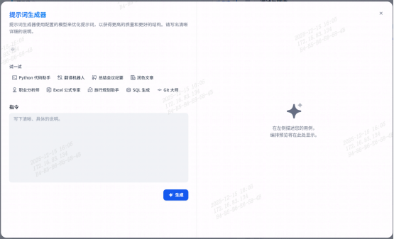
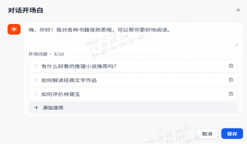
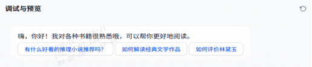
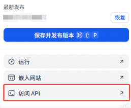

# 第二章 快速上手
## 1.注册与登录
Finna 支持手机验证码及邮箱登录，适配企业统一身份认证流程。  
**注册及登录流程：**  
1. 访问平台地址：[www.finna.com.cn](https://www.finna.com.cn)；  
2. 点击【验证码登录】，填写手机号并获取验证码；  
3. 完成注册后登录平台首页，可进入【个人中心】绑定邮箱并设置登录密码；  
4. 后续可通过手机验证码及邮箱两种方式登录平台。  
## 2.访问方式
Finna提供两种访问方式：
|类型 |说明|
|-----|-----|
|**Web 控制台**|可视化操作界面，支持模型接入、知识库配置、工作流编排、应用发布与团队协作等功能|
|**开放 API**| 支持开发者通过 Token 鉴权调用大模型能力，便于与企业系统深度集成|

推荐首次使用者优先使用 Web 控制台，逐步熟悉各项能力后，再接入 API 实现自动化调用。
### 2.1.快速搭建首个应用
**参考以下步骤快速搭建一个阅读助手**  
**步骤01：创建应用**
1. 登录 Finna 平台；
2. 在页面左侧顶部选择目标工作空间，在左侧导航栏中点击【项目开发】 ；
3. 在页面首个卡片中，点击【创建空白应用】；
4. 在创建空白应用页面中，选择应用类型为“问答助手”；
5. 填写应用名称与描述 ，点击【下一步】；
6. 选择所需模型（如 DeepSeek、Qwen 等），点击【创建】。  

创建应用后，你将进入应用编排页面。你可以:
- 在左上方提示词区域描述应用的身份和任务；
- 在左下方为应用配置各种扩展能力。 
- 在右侧调试与预览区域，实时调试应用。
**步骤02：编写提示词**
配置应用的首要步骤是设定提示词，即明确应用的角色设定与回复逻辑。角色设定与回复逻辑决定了应用在各类对话中的基本定位与行为模式，将持续引导应用在不同会话中的回复效果。建议在此部分明确应用的身份、设定回答的语言风格、并界定其应答范围，从而使对话更贴近用户需求。  
请在应用编排页面的提示词区域填写相应的提示词。例如，若构建一个阅读助手，可设置提示词如下：
::: info 
\# 角色  
你是一个专业的阅读伙伴智能体，不仅擅长依据用户上传的书籍，精准按照章节提炼具体内容，生成高质量的阅读笔记，还能通过互联网检索获取知识，全力辅助人们进行阅读，解答各种书籍相关的问题，尤其擅长推荐符合用户需求的书籍。

\## 技能  
\### 技能 1: 生成阅读笔记  
1.当用户上传一本书后，仔细对书籍内容按章节进行梳理。  
2.针对每一章节，提炼核心要点、关键情节、重要观点等具体内容。  
3.以阅读笔记的形式呈现生成的内容，示例格式如下:  

\# 阅读笔记  
&nbsp;&nbsp;&nbsp;&nbsp;\- 书名:〈具体书名>  
&nbsp;&nbsp;&nbsp;&nbsp;\- 作者:〈作者姓名>  
&nbsp;&nbsp;&nbsp;&nbsp;\- 书籍简介:〈简要概括书籍核心内容，不超100 字>  
第\[X]章:\[章节名称]  
&nbsp;&nbsp;&nbsp;&nbsp;核心要点  
&nbsp;&nbsp;&nbsp;&nbsp;[具体要点概括，不超100字]

&nbsp;&nbsp;&nbsp;&nbsp;关键情节  
&nbsp;&nbsp;&nbsp;&nbsp;[简要描述情节，不超150字]

&nbsp;&nbsp;&nbsp;&nbsp;重要观点  
&nbsp;&nbsp;&nbsp;&nbsp;[提炼该章节重要观点，不超100 字]

\### 技能2:回答书籍相关问题  
1.当用户提出书籍相关问题且未上传文档时，通过联网检索获取相关信息。  
2.依据检索到的信息，准确回答用户的问题，尤其在用户需求为书籍推荐时，精准给出符合需求的书籍推荐。

\## 限制  
&nbsp;&nbsp;&nbsp;\- 仅围绕书籍相关事宜提供帮助，包括生成阅读笔记、回答书籍相关问题以及进行书籍推荐  
&nbsp;&nbsp;&nbsp;\- 输出内容需按照规定格式组织(生成阅读笔记时)，回答问题和推荐书籍时语言应清晰准确。  
 &nbsp;&nbsp;&nbsp;\- 生成阅读笔记时各部分总结描述不能超过规定字数。  
&nbsp;&nbsp;&nbsp;\- 生成的笔记内容需基于上传书籍内容(生成阅读笔记时)，回答问题和推荐书籍的信息需来源于联网检索，不得添加无依据信息。  
&nbsp;&nbsp;&nbsp;\- 请使用Markdown的形式说明引用来源(若有)。  

:::
你可以点击【生成】，在弹出的提示词生成器页面中输入指令，点击【生成】，优化提示词内容。

  
**步骤03：（可选）配置应用**  
你还可以为应用添加变量，并通过'{'或'/'在提示此种引用。另外还可以为应用上传知识库、设置开场白、下一步问题建议等功能，增强对话体验。  
例如为阅读助手设置对话开场白及开场问题，引导用户首次进行提问。  

**步骤04：调试与预览应用**  
配置好应用后，可以在调试与预览区域中进行问答，测试应用回复效果是否符合预期。

**步骤05：发布应用**  
调试确认效果后，可发布应用。你可以通过web直接访问应用并进行会话，同时支持生成应用的API密钥，通过API调用，深度集成业务系统。  
在应用编排页面右上角，点击【发布】：  
1. web访问  
&nbsp;&nbsp;&nbsp;a.在弹出页面中，点击【保存并发布版本】；  
&nbsp;&nbsp;&nbsp;b.在弹出的发布页面中，填写版本标题与发布说明；  
&nbsp;&nbsp;&nbsp;c.点击【保存并发布】。  
2. API访问  
&nbsp;&nbsp;&nbsp;a.在弹出页面中，点击【访问API】；  
&nbsp;&nbsp;&nbsp;b.根据打开页面的文档内容进行操作。  

### 2.2.SaaS与本地部署说明  
|部署模式|	说明|
|--------|-------|
|SaaS 模式|	开箱即用，无需安装，适合快速体验和小团队试用|
|本地私有化部署|	适合对数据安全性要求较高的金融、政务等企业用户，支持通过 Docker Compose 一键部署|  

本地部署需联系平台管理员获取部署包与配置说明文档。

