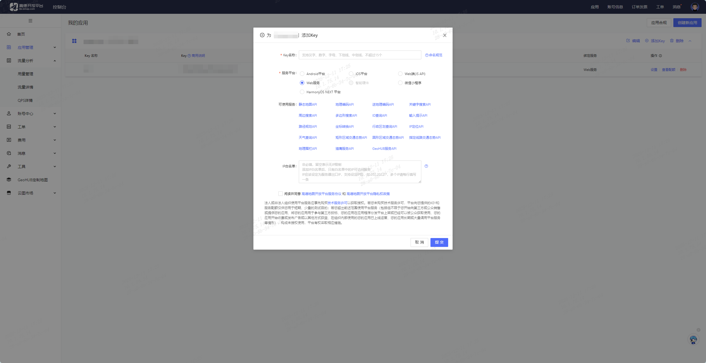
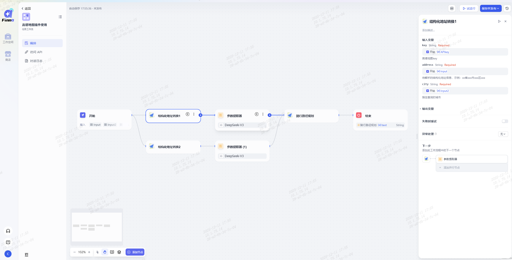
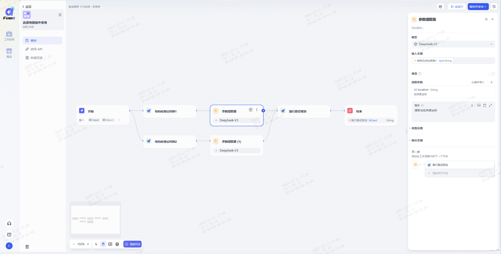
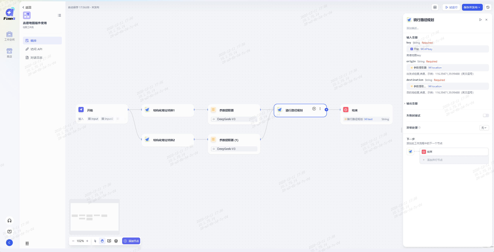
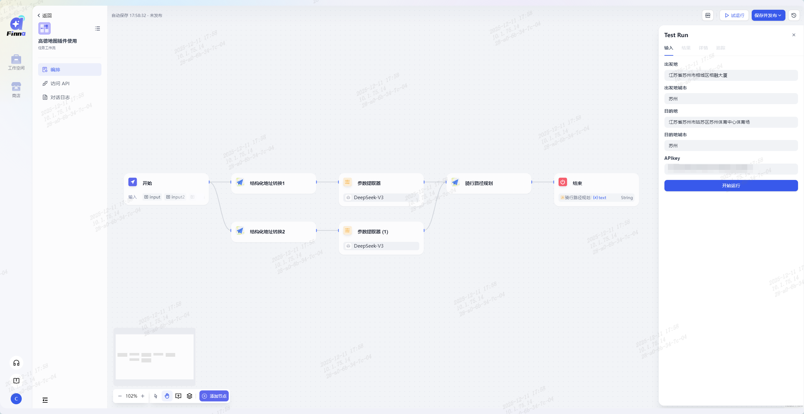
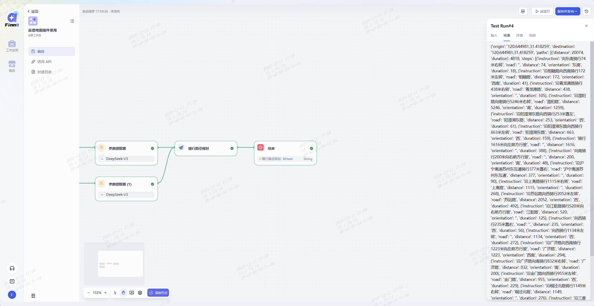
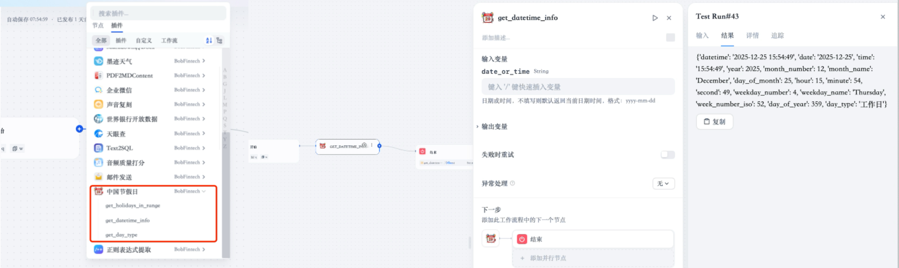

# 第六章 插件
## 6.1高德地图插件
Finna平台高德地图系列插件是工作中批量处理路线规划、地址与经纬度转换，还是跨平台同步多城市天气信息，它都能实现全流程自动化，彻底告别重复手动操作，让效率直线提升～整合了骑车、驾车、公共交通、步行4类路径规划，以及距离测量、地址&经纬度转换、IP定位、城市天气查询共9大核心功能，可直接作为节点插入，无需懂代码，可视化拖拽即可完成联动配置，实现地理信息相关工作的自动化流转！  
第一步：前置工作——获取高德地图API Key  
登录高德地图开放平台，进入「控制台」-「应用管理」，创建新应用并添加Key（推荐选择web服务类型）  
   
第二步：核心配置——按需搭建工作流，接入高德地图插件  
以「出发地→目的地路线规划」为例，操作流程如下：  
1、&nbsp;&nbsp;地址转经纬度：通过「结构化地址转换」，将出发地、目的地的文字地址转换为标准经纬度；
   
2、&nbsp;&nbsp;提取关键参数：使用「参数提取器」，从地址转换结果中提取出发地、目的地的经纬度信息；
   
3、&nbsp;&nbsp;配置路径规划：将提取的经纬度参数接入「路径规划插件」，即可自动生成最优路线；

第三步：测试验证——确认联动效果无误

&nbsp;&nbsp;输入测试参数（如具体地址），验证插件功能是否正常运行、结果是否准确同步至目标节点；

 &nbsp;&nbsp;测试通过后，工作流即可正式启用。

## 6.2中国节假日
● get_holidays_in_range：支持在指定日期区间内查询节假日信息，精准返回日期对应的节假日名称；  
● get_datetime_info：支持获取当前日期时间或指定日期的详细信息，如星期、月份等；  
● get_day_type：支持判断指定日期是否为节假日、工作日、休息日，覆盖调休补班等特殊场景。  
   
以下是 3 个场景的插件接入示例：  
● 银行智能客服工作流：用户咨询节假日业务办理时间时，自动触发「get_holidays_in_range」插件，结合网点营业规则生成精准回复，无需人工手动查询；  
● 排班系统工作流：在坐席明日排班流程中接入「get_day_type」插件，自动识别明日是否为节假日或休息日，智能安排人员值班，避免人力调度失误；  
● 时间识别工作流：通过「get_datetime_info」获取当前时间，判断用户问题中 “明天”“下周” 等模糊时间指代的具体日期，联动智能客服生成精准回复。  
