# 第四章 模型  
模型商店集中管理平台可用的模型资源，覆盖多家模型供应商及多种模型类型，为应用构建与系统集成提供统一模型入口。  
模型商店支持多家供应商模型接入，如通义千问、硅基流动等，涵盖对话类模型、推理模型、语音模型、嵌入模型、视觉模型等多种类型。  
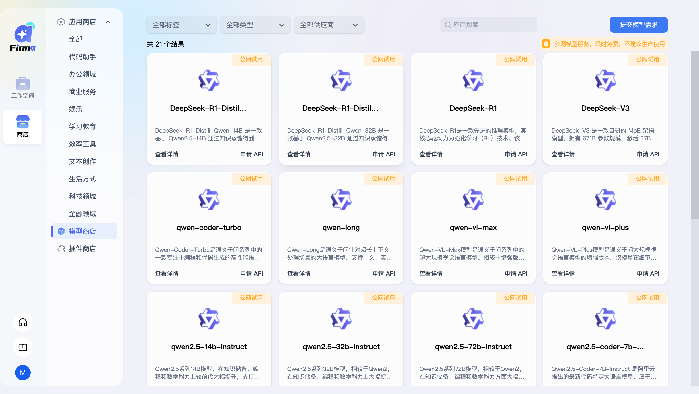 
用户可在模型商店中，点击模型卡片上的【查看详情】查看模型的基础信息、能力标签及适用场景。
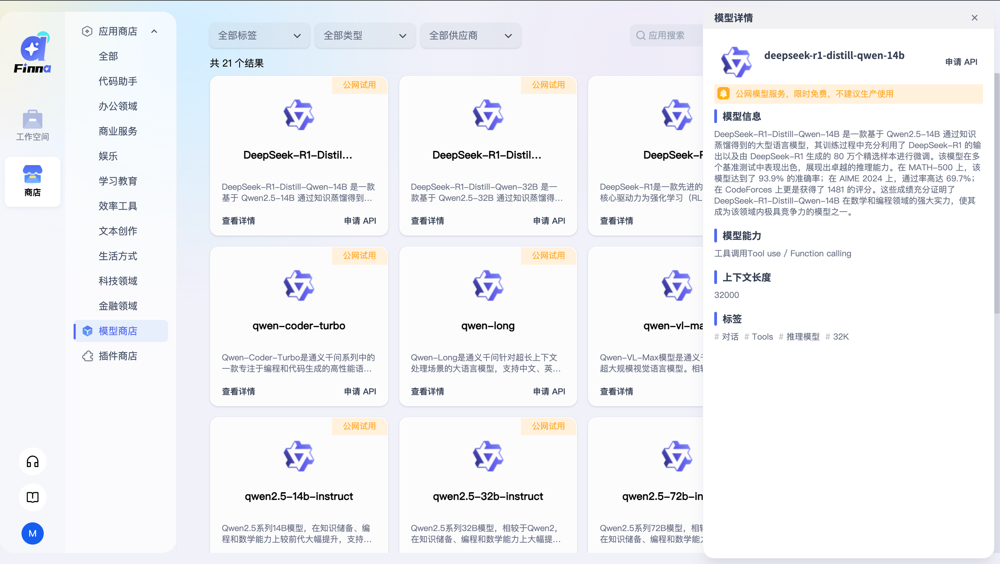 
支持在应用配置过程中直接选择并调用相关模型。
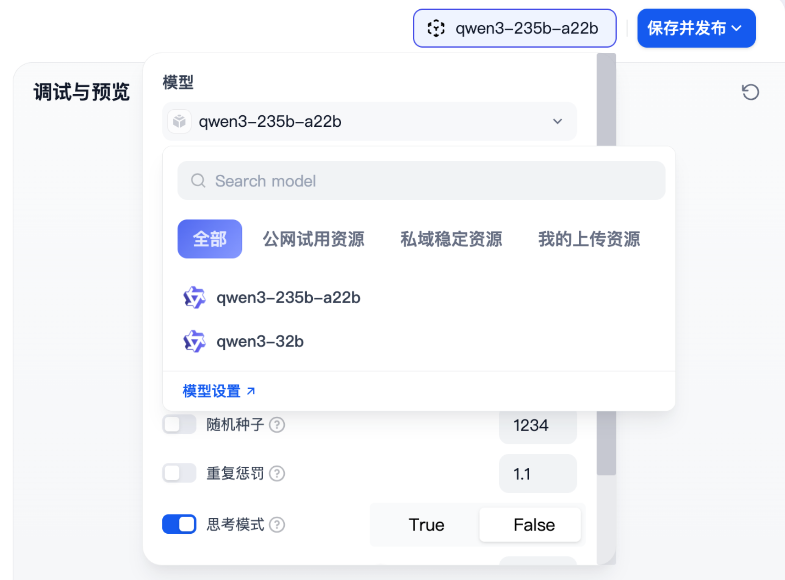 
同时，模型商店支持用户通过模型卡片的【申请API】直接申请模型 API，通过 API 方式将模型能力集成至外部业务系统，实现平台能力的对外调用与复用。
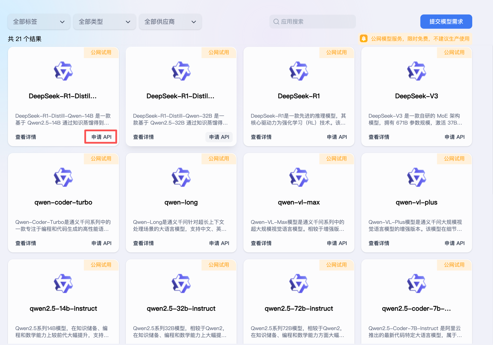 
## 4.1模型申请API  
提供对于单纯调用大模型的API调用能力。  
在【商店】-【模型商店】可以看到模型商店所有的模型，根据自己的需要找到对应的模型，点击【申请API】弹出页面如下，模型名称、申请账号不可修改，归属空间根据自己的需求点选，最后点击【申请】完成API申请。
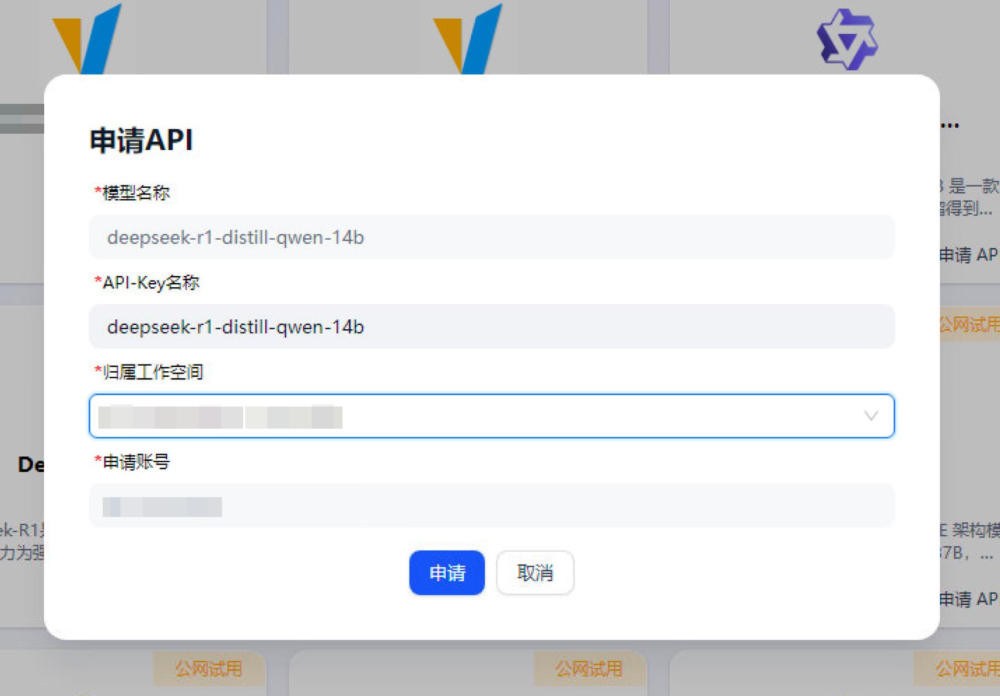 
弹出提示，API-key如下，API调用示例参考如下，API Key名称自动带出，不可修改；点击【复制】，页面提示“复制成功！”；
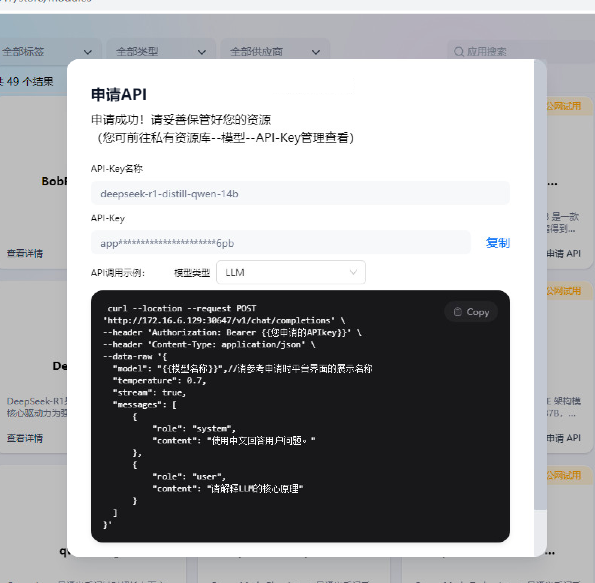 
**对应API调用示例**  
LLM模型API Key调用示例：  
```
curl --location --request POST 'https://www.finna.com.cn/v1/chat/completions' \
--header 'Authorization: Bearer {{您申请的APIkey}}' \
--header 'Content-Type: application/json' \
--data-raw '{
    "model": "{{模型名称}}",//请参考申请时平台界面的展示名称
    "temperature": 0.7,
    "stream": true,
    "messages": [
        {
            "role": "system",
            "content": "使用中文回答用户问题。"
        },
        {
            "role": "user",
            "content": "请解释LLM的核心原理"
        }
    ]
}'  
```
TTS模型API Key调用示例：
```
curl --location --request POST \
'https://finna.com.cn/v1/audio/speech' \
--header 'Authorization: Bearer YOUR_API_KEY' \   # 替换为您的APIKey
--header 'Content-Type: application/json' \
--data-raw '{
   "model": "MODEL_NAME",   # 替换为模型名称
   "input": "一条大河波浪宽，风吹稻花香两岸",  # 替换为您要合成的文本
   "voice": "fnlp/MOSS-TTSD-v0.5:anna",  # 可选，发音人，参考平台列表
   "stream": true  # 可选，是否流式返回，默认为true
}'
```
Embedding模型API Key调用示例：
```
curl --location --request POST 'https://finna.com.cn/v1/embeddings' \
--header 'Authorization: Bearer app-VCbDwNt' \  # 替换为您的实际API密钥
--header 'Content-Type: application/json' \
--data-raw '{
   "model": "text-embedding-v1",  # 替换为实际使用的模型名称
   "input": "人工智能正在深刻改变各行各业，从医疗诊断到金融风控，再到自动驾驶，AI技术的应用场景日益广泛。随着大语言模型的突破性进展，自然语言处理能力显著提升，机器能够理解并生成更复杂、更符合人类表达的文本内容。",  # 替换为您需要嵌入的文本内容
   "encoding_format": "float"  # 可选参数：返回向量的编码格式，通常为"float"或"base64"
}'
```
使用postman调用输出如下，需注意：**stream为true，输出为流式，为false为非流式**。
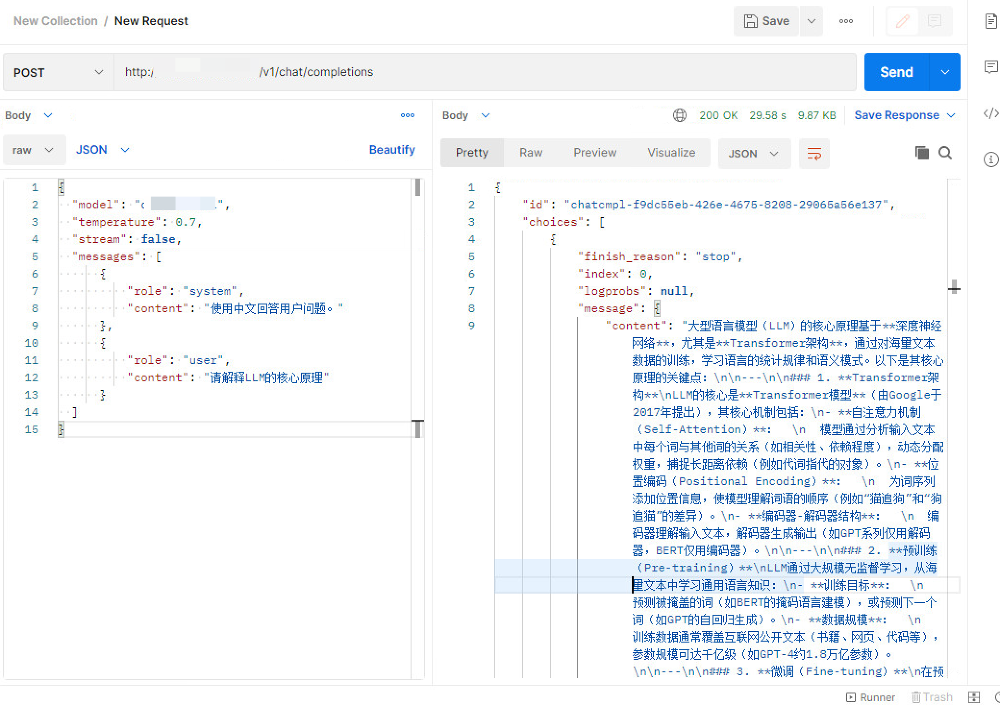 
## 4.2APIKey管理  
在【工作空间】-【私有资源库】-【模型】页面，点击【API-Key管理】查看。
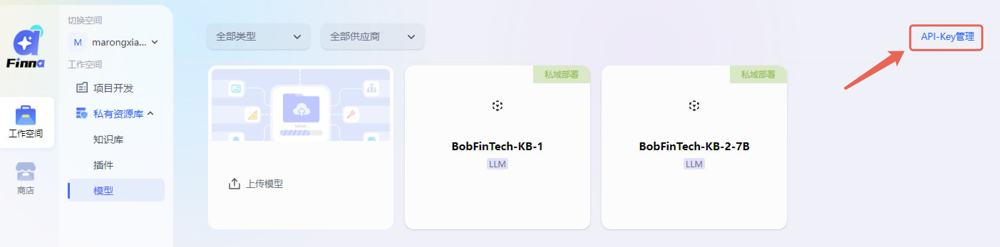   
(1)我的：显示个人空间或团队空间中本人已申请的API-Key；  
(2)全部：显示团队空间中团队空间成员申请的API-Key；  
(3)切换至个人空间时，全部用户可见“API-Key管理”功能按钮，切换至团队空间时，仅团队空间角色为团队管理员或开发可见“API-Key管理”功能按钮。  
点击【API-Key管理】页面展示如下
【复制】按钮为复制API-key  
【编辑】按钮为编辑【API-key名称】  
【复制】按钮删除申请的API-key  
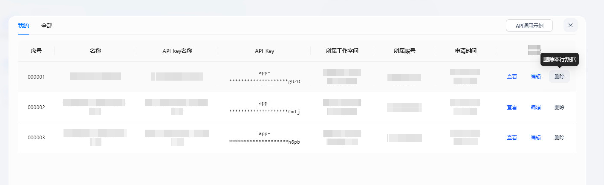   
## 4.3提交模型需求
在【商店】-【模型商店】页面，右上角有个按钮【提交模型需求】，主要是收集用户的模型需求，可以根据自己的需求提交。
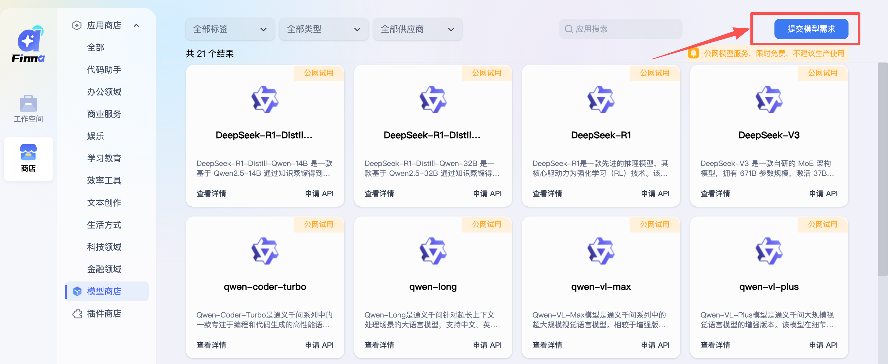
## 4.4上传自定义模型  
在【私有资源库】-【模型】页面，点击【上传模型】
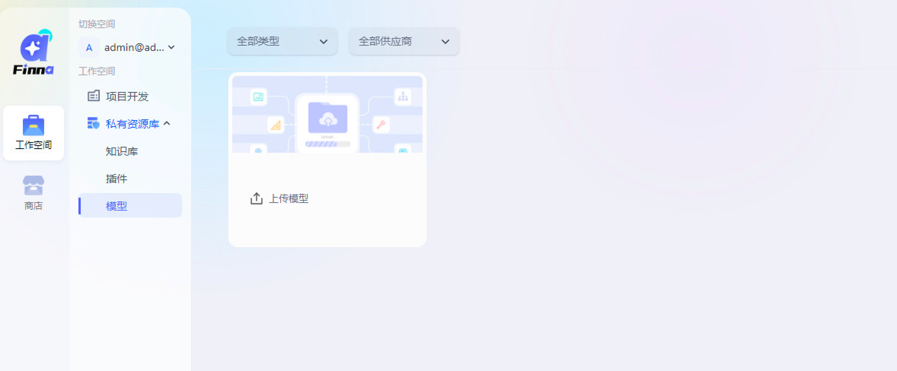
点击【上传模型】后弹出页面如下，点选模型类型，有LLM、Rerank、Text Embedding、Speech2text、TTS等五种类型，根据自己上传的模型类型点选对应的模型类型。
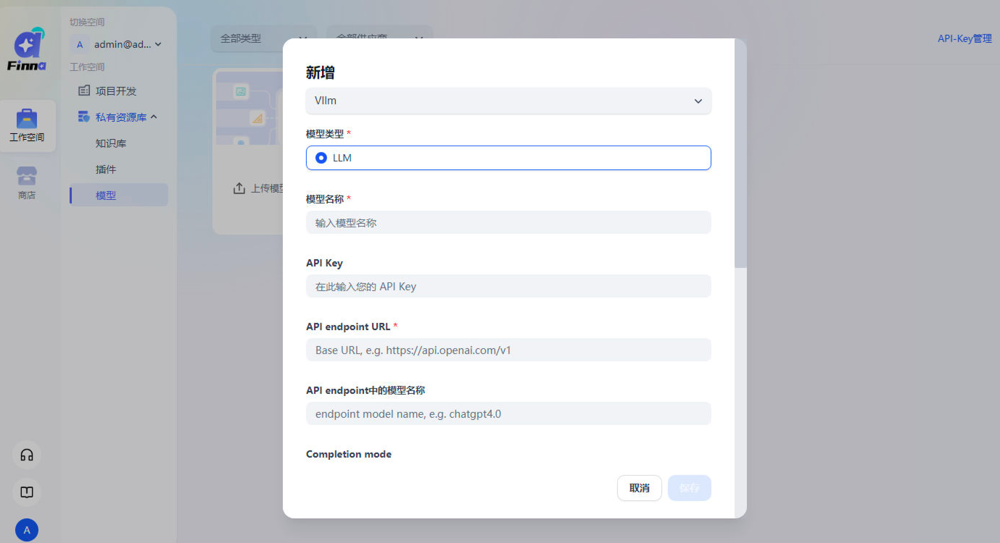
在API endpoint URL上传对应的模型地址和上下文长度。
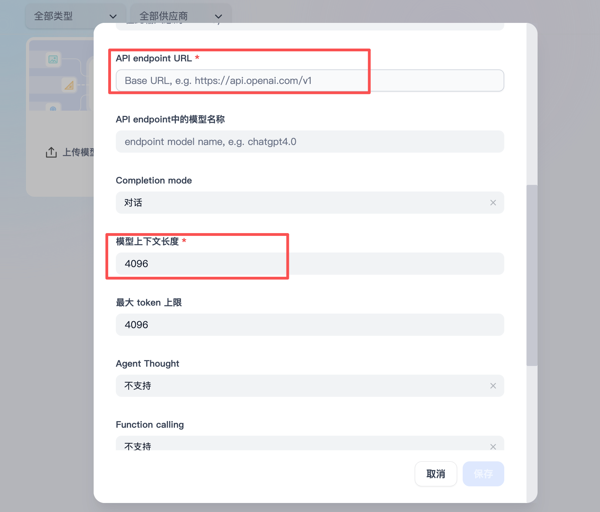
模型上传成功后，弹出“上传成功”的提示，并显示【私域部署】。
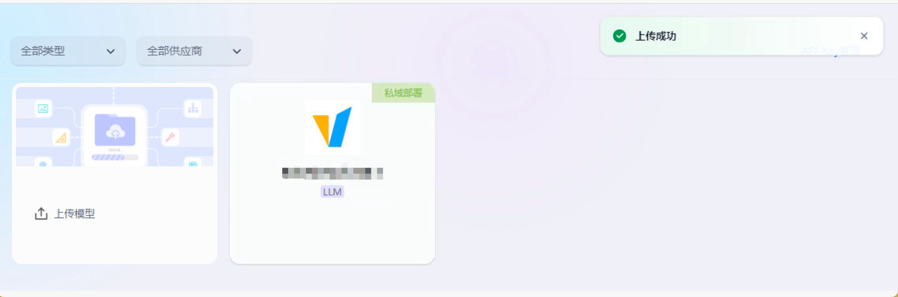
